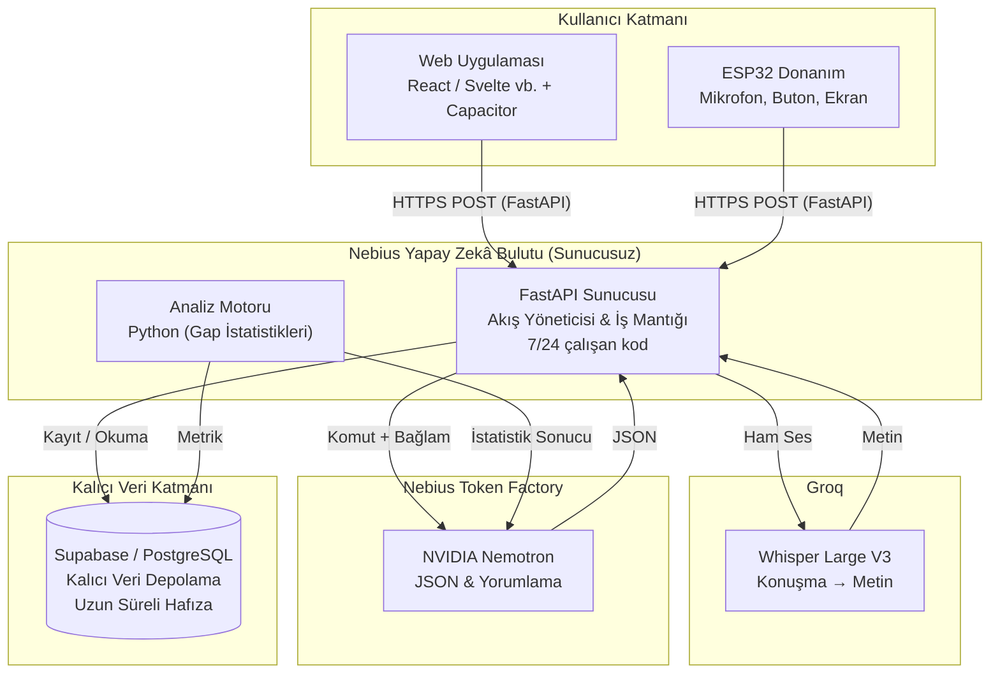

# GAP: Sistem Mimarisi

*Bu belge, GAP sisteminin bileşenlerini, veri akışını ve Nebius/NVIDIA altyapısı, Groq ses tanıma hizmeti ve barındırma yaklaşımını anlatır.*

## 1. Genel Mimari Şeması

## 2. Bileşenler

### 2.1 Kullanıcı Katmanı

Bu katman yalnızca veri toplar ve gösterir; iş mantığı içermez.

- **Web Uygulaması:** React, Svelte gibi bir web çatısıyla yazılır (seçim takıma bağlı), Capacitor ile Android ve iOS uygulamasına paketlenir. Kullanıcıdan yazılı girdi ya da mikrofonla sesli girdi (Blob biçiminde) alır. Analiz grafiklerini gösterir.
- **ESP32:** I2S mikrofonla sesi 16 kHz WAV olarak kaydeder ve HTTPS üzerinden doğrudan FastAPI'ye gönderir. Fiziksel butonlarla (yapıldı, ertelendi, atlandı) planın durumunu bildirir.

### 2.2 Sunucu Katmanı (FastAPI)

Sistemin beyni ve trafik yöneticisidir. Nebius sunucusuz ortamında Docker konteyneri olarak **7/24** çalışır.

- **API Geçidi:** İstemcilerden gelen HTTP(S) isteklerini (/parse, /voice, /plans/{id}/outcome) karşılar.
- **Akış Yöneticisi:** Gelen sesi önce konuşma tanımaya (Whisper) gönderir, ardından Uzun Süreli Hafızadaki geçmiş davranışlarla birleştirip dil modeline (LLM) iletir.
- **GAP Analiz Motoru:** Yapay zekânın yapmaması gereken matematiksel hesapları (uyum yüzdesi, hangi gün ve saatlerde erteleme yapıldığı, gecikme süresi) yapar.
- **7/24 Çalışan Kod:** Sunucu kesintisiz açık kalır; ESP32 ya da web uygulaması her an istek gönderebilir. Erteleme örüntülerini kontrol eden zamanlayıcı görevler de bu kodun içinde sürekli çalışır.
- **Geçici Veri Depolama:** Nebius tarafında bellek/önbellekte tutulur: oturum bilgisi, ses ve metin ara sonuçları, sık kullanılan istatistiklerin önbelleği. Sunucu yeniden başlarsa silinebilir; bu yüzden kalıcı hiçbir veri burada tutulmaz.

### 2.3 Yapay Zekâ Katmanı (Groq ve Nebius Token Factory)

Ses tanıma doğrudan Groq API'si üzerinden Whisper Large V3 modeliyle, dil modeli ise Nebius Token Factory üzerinden NVIDIA Nemotron ile çalışır. İkisi de REST API ile çağrılır.

- **STT (Konuşmayı Metne Çevirme) — Whisper Large V3:** Groq API'sinde çalışır; kullanıcıdan gelen WAV ses dosyasını yazıya dönüştürür.
- **LLM (NVIDIA Nemotron):** **Girdiyi Ayrıştırma** — Metni alır ve JSON şemasıyla kısıtlanmış yapılandırılmış bir çıktıya (niyet, tarih, saat, kategori) dönüştürür. **Yorumlama** — Analiz motorunun ürettiği sayıları okur (örn. "%67 uyum, salı günleri erteleme") ve kullanıcıya doğal dille, uygulanabilir bir öneri yazar.

### 2.4 Veri Katmanı (Supabase / PostgreSQL): Kalıcı Veri Depolama

Kalıcı veriler yalnızca burada saklanır. Modelin veritabanına doğrudan erişimi yoktur; tüm erişim FastAPI üzerinden yapılır. Bu katman sistemin Uzun Süreli Hafızasıdır.

- **users:** Kimlik bilgisi, saat dilimi ve yetkilendirme (Auth) anahtar özetleri.
- **plans:** Planlanan niyetler, başlangıç ve bitiş zamanları.
- **outcomes:** Kullanıcının eylemleri (yapıldı, ertelendi, atlandı) ve gerçekleşme zamanları.

### Depolama Türlerinin Karşılaştırması

|  | Geçici Depolama | Kalıcı Depolama |
|---|---|---|
| Yer | Nebius sunucusu (bellek / önbellek) | Supabase / PostgreSQL |
| Ne tutar? | Oturum, ara sonuçlar, istatistik önbelleği | Kullanıcılar, planlar, sonuçlar, geçmiş davranış |
| Ömrü | Sunucu yeniden başlayana kadar | Silinene kadar süresiz |

## 3. Temel Veri Akışları

### Akış A: Sesli Plan Oluşturma

1. **Kayıt:** ESP32 ya da web uygulaması sesi kaydeder ve FastAPI'nin POST /voice adresine gönderir.
2. **Metne Çevirme:** FastAPI sesi doğrudan Groq Whisper Large V3'e iletir ve yazıyı alır (örn. "Akşam koşuya gideceğim"). Ara sonuç geçici depolamada tutulur.
3. **Bağlam Toplama:** FastAPI, Supabase'ten kullanıcının saat dilimini ve benzer geçmiş planlarını (Uzun Süreli Hafıza) çeker.
4. **Ayrıştırma:** Metin, güncel saat ve bağlam Nemotron'a gönderilir. Model katı bir JSON çıktısı döndürür.
5. **Kaydetme ve Yanıt:** FastAPI gelen JSON'ı Pydantic ile doğrular, Supabase'teki plans tablosuna kalıcı olarak kaydeder ve ESP32'ye "Başarılı" yanıtı döner.

### Akış B: GAP Analizi ve Kendiliğinden Öneri

1. **Eylem Bildirimi:** ESP32'de bir butona basılır (örn. uzun basış = atlandı) ve POST /plans/{id}/outcome çağrılır.
2. **Metrik Güncelleme:** FastAPI sonucu Supabase'e yazar. Python analiz motoru kullanıcının yeni başarı oranını ve erteleme örüntüsünü hesaplar; sonuçlar geçici depolamada önbelleğe alınır.
3. **Tetikleme:** 7/24 çalışan zamanlayıcı, kullanıcının sürekli ertelediği bir örüntü bulursa (örn. spor üçüncü kez atlandı) öneri sürecini başlatır.
4. **LLM Yorumu:** FastAPI, hesaplanan net sayıları Nemotron'a gönderir ve "Bu verilere dayanarak kısa bir öneri yaz" der.
5. **Öneriyi Sunma:** Modelin yazdığı metin (örn. "Sporu sürekli atlıyorsun, sabah saatine alalım mı?") kaydedilir ve ilk fırsatta web uygulaması üzerinden kullanıcıya gösterilir.

## 4. Altyapı ve Dağıtım

- **Barındırma:** Nebius Yapay Zekâ Bulutu (sunucusuz uç noktalar).
- **Paketleme:** FastAPI uygulaması bir Dockerfile ile paketlenir.
- **Çalışma Şekli:** Kod 7/24 açık kalır; zamanlayıcı görevler ve gelen istekler kesintisiz karşılanır.
- **Ölçekleme:** İstek sayısı artınca sunucusuz yapı kopya sayısını otomatik artırır, azalınca düşürür.
- **Depolama:** Geçici veriler Nebius tarafında, kalıcı veriler Supabase'te tutulur. Sunucu yeniden başlasa bile kalıcı veriler etkilenmez.
- **Dış Bağlantılar:** Sistem yalnızca dışarıya (Supabase, Nebius Token Factory, Groq, hava durumu API'si) REST istekleri gönderir; sunucu içinde kalıcı durum tutulmaz.
