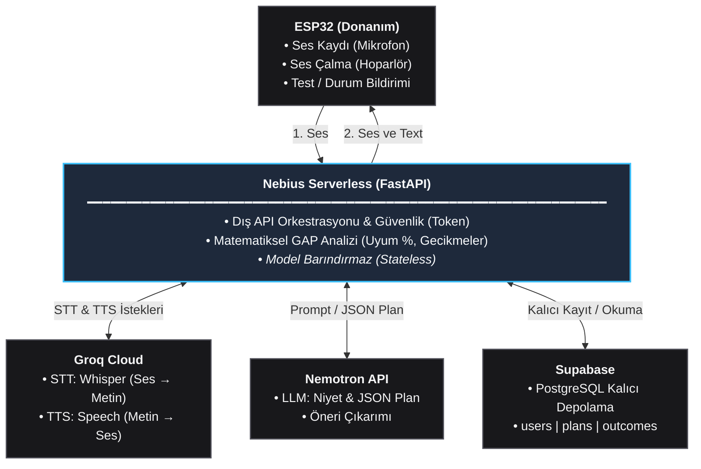

# GAP: Yapay Zekâ Servisleri Entegrasyon Şeması (AI_SCHEMA)

Bu belge; Nebius Serverless üzerinde çalışan FastAPI orkestratörünün **Groq Cloud (Whisper STT & TTS)** ve **Nebius Token Factory (NVIDIA Nemotron LLM)** ile olan doğrudan iletişimini, API uç noktalarını, parametrelerini, prompt yapısını ve `ai/schema.json` uyumunu eksiksiz olarak tanımlar.

---

## 1. Mimari Şema



---

## 2. Bileşen Sorumlulukları

| Bileşen | Sorumluluk / Ne Yapar? |
|---|---|
| **ESP32 (Donanım)** | • I2S mikrofon ile sesi 16 kHz Mono WAV formatında kaydeder ve FastAPI'ye gönderir.<br/>• FastAPI'den dönen sentezlenmiş ses verisini hoparlörden çalar.<br/>• Cihaz test telemetrisi (`ping`) ve buton basış durumlarını (`outcome`) iletir. |
| **Nebius Serverless (FastAPI)** | • Sistemin tek iletişim ve orkestrasyon merkezidir.<br/>• Bearer token ile donanım kimlik doğrulamasını yapar.<br/>• Groq (STT/TTS), Nemotron ve Supabase API çağrılarını sırayla yönetir.<br/>• Uyum yüzdesi ve gecikme gibi matematiksel hesaplamaları yürütür (Stateless). |
| **Groq Cloud** | • Whisper Large V3 ile gelen sesi minimum gecikmeyle metne çevirir (STT).<br/>• FastAPI'nin ilettiği onay/cevap metnini doğrudan çalınabilir sese dönüştürür (TTS). |
| **Nemotron API** | • Transkript metnini ayrıştırarak JSON şemasına uygun plan verisi (başlık, tarih, saat, kategori) üretir.<br/>• Kullanıcı geçmişine göre proaktif öneri metinleri oluşturur. |
| **Supabase** | • Kullanıcılar (`users`), oluşturulan planlar (`plans`) ve gerçekleşen eylemler (`outcomes`) için PostgreSQL kalıcı depolamasıdır. |

---

## 3. Yapay Zekâ Servisleri Entegrasyon Sözleşmesi

FastAPI sunucusu, yapay zekâ işlevleri için iki harici sağlayıcıyı OpenAI uyumlu REST API protokolü üzerinden tüketir:
1. **Groq Cloud:** STT (Konuşma -> Metin) ve TTS (Metin -> Konuşma)
2. **Nebius Token Factory:** NVIDIA Nemotron LLM (Plan Çıkarımı & Öneri Üretimi)

```
[ESP32 Ses (WAV)] 
   ──> FastAPI 
   ──> 1. Groq STT (Whisper) ──> Transkript Metni
   ──> 2. Nebius Token Factory (Nemotron) ──> ParsedPlan (JSON)
   ──> Supabase Kaydı
   ──> 3. Groq TTS ──> Sentezlenmiş Ses (WAV)
   ──> FastAPI 
   ──> [ESP32 Hoparlör (WAV)]
```

---

### 3.1. Groq Cloud: Speech-to-Text (STT) - Whisper Large V3

Groq LPU (Language Processing Unit) altyapısı sayesinde Whisper modelleri 100-300 ms gibi ultra düşük gecikmeyle çalışır. ESP32'den gelen 16 kHz mono WAV sesi doğrudan bu uç noktaya yönlendirilir.

* **API Uç Noktası:** `POST https://api.groq.com/openai/v1/audio/transcriptions`
* **Yetkilendirme:** `Authorization: Bearer $GROQ_API_KEY`
* **İçerik Tipi:** `multipart/form-data`

#### İstek Parametreleri (Form-Data)

| Parametre | Tip | Zorunlu | Değer / Açıklama |
|---|---|---|---|
| `file` | Binary | Evet | ESP32'den gelen 16 kHz, 16-bit Mono WAV ses dosyası (azami 10 sn / ~320 KB). |
| `model` | String | Evet | `whisper-large-v3` (veya `whisper-large-v3-turbo`). Yüksek doğruluk ve Türkçe dil desteği için `whisper-large-v3` önerilir. |
| `language` | String | Hayır | `"tr"` (Modelin dil tahmin adımını atlayıp gecikmeyi düşürmek ve Türkçe doğruluğunu artırmak için sabitlenir). |
| `response_format` | String | Hayır | `"json"` (Varsayılan) veya `"verbose_json"`. |
| `temperature` | Float | Hayır | `0.0` (Halüsinasyonu engellemek ve deterministik transkript almak için). |

#### Örnek İstek (HTTP / cURL)
```http
POST /openai/v1/audio/transcriptions HTTP/1.1
Host: api.groq.com
Authorization: Bearer gsk_...
Content-Type: multipart/form-data; boundary=----WebKitFormBoundary

------WebKitFormBoundary
Content-Disposition: form-data; name="model"

whisper-large-v3
------WebKitFormBoundary
Content-Disposition: form-data; name="language"

tr
------WebKitFormBoundary
Content-Disposition: form-data; name="temperature"

0.0
------WebKitFormBoundary
Content-Disposition: form-data; name="file"; filename="audio.wav"
Content-Type: audio/wav

<binary audio bytes>
------WebKitFormBoundary--
```

#### Başarılı Yanıt (HTTP 200 OK)
```json
{
  "text": "Yarın saat 18:00'de spor salonuna gideceğim."
}
```

---

### 3.2. Nebius Token Factory: NVIDIA Nemotron LLM (Plan Çıkarımı)

Nebius Token Factory, NVIDIA'nın gelişmiş açık kaynaklı **Nemotron** model ailesini sunar. Model, OpenAI uyumlu `/chat/completions` arayüzü ve JSON modu ile çağrılır. Üretilen çıktının projedeki **`ai/schema.json` (ParsedPlan)** sözleşmesine harfiyen uyması şarttır.

* **API Uç Noktası:** `POST https://api.studio.nebius.ai/v1/chat/completions`  
  *(veya `.env` içinde tanımlanan `$NEBIUS_BASE_URL/chat/completions`)*
* **Yetkilendirme:** `Authorization: Bearer $NEBIUS_API_KEY`
* **İçerik Tipi:** `application/json`
* **Kullanılan Model:** `.env.example` içinde tanımlı modeller:
  * `MODEL_ULTRA`: `nvidia/Llama-3_1-Nemotron-Ultra-253B-v1` *(veya `nvidia/Llama-3_1-Nemotron-70B-Instruct-HF`)*
  * `MODEL_NANO`: `nvidia/nemotron-mini-4b-instruct` *(hızlı sınıflandırmalar için)*

#### İstek Gövdesi (JSON Payload)

| Alan | Tip | Değer |
|---|---|---|
| `model` | String | `"nvidia/Llama-3_1-Nemotron-Ultra-253B-v1"` |
| `temperature` | Float | `0.1` (Kural tabanlı JSON doğruluğu için çok düşük sıcaklık) |
| `response_format` | Object | `{"type": "json_object"}` |
| `messages` | Array | `system` (Sistem promptu + `ai/schema.json` kuralları) ve `user` (Transkript + Güncel Tarih + Saat Dilimi) |

#### Sistem Promptu ve İstek Örneği

```json
{
  "model": "nvidia/Llama-3_1-Nemotron-Ultra-253B-v1",
  "temperature": 0.1,
  "response_format": { "type": "json_object" },
  "messages": [
    {
      "role": "system",
      "content": "Sen GAP asistanının niyet ve plan ayrıştırma motorusun. Kullanıcının konuşma transkriptini analiz ederek YALNIZCA geçerli bir ParsedPlan JSON nesnesi döndür.\n\nJSON ŞEMASI KURALLARI:\n- intent: 'create_plan' | 'clarify' | 'unsupported'\n- title: Planlanan eylemin kısa adı (ör. 'Spor salonu', 'Ders çalışma') veya null\n- category: 'sport' | 'study' | 'work' | 'meeting' | 'health' | 'social' | 'personal' | 'other'\n- date: YYYY-MM-DD formatında tarih veya null\n- time: HH:MM formatında (24 saat) başlangıç saati veya null\n- duration_minutes: integer (varsayılan 60, min 5, max 1440) veya null\n- recurrence: Tekrarlama kuralı (ör. 'FREQ=WEEKLY;BYDAY=TU') veya null\n- language: 'tr' | 'en'\n- needs_weather_check: Dış mekan eylemi ise true, değilse false\n- clarification_question: Eğer saat/tarih belirsizse soru sor, aksi halde null\n- confidence: 0.0 ile 1.0 arasında güven skoru\n\nEk açıklama, markdown bloğu veya selamlaşma yazma. SADECE saf JSON nesnesi üret."
    },
    {
      "role": "user",
      "content": "Güncel Tarih: 2026-10-09\nSaat Dilimi: Europe/Istanbul\nTranskript: \"Yarın saat 18:00'de spor salonuna gideceğim.\""
    }
  ]
}
```

#### Başarılı Model Yanıtı (`ai/schema.json` Uyumlu)
```json
{
  "id": "chatcmpl-nebius-92184",
  "object": "chat.completion",
  "created": 1791544800,
  "model": "nvidia/Llama-3_1-Nemotron-Ultra-253B-v1",
  "choices": [
    {
      "index": 0,
      "message": {
        "role": "assistant",
        "content": "{\n  \"intent\": \"create_plan\",\n  \"title\": \"Spor salonu\",\n  \"category\": \"sport\",\n  \"date\": \"2026-10-10\",\n  \"time\": \"18:00\",\n  \"duration_minutes\": 60,\n  \"recurrence\": null,\n  \"language\": \"tr\",\n  \"needs_weather_check\": false,\n  \"clarification_question\": null,\n  \"confidence\": 0.98\n}"
      },
      "finish_reason": "stop"
    }
  ]
}
```

*FastAPI gelen `choices[0].message.content` dizgesini Pydantic ile doğrular. Doğrulama başarısız olursa model bir kez daha uyarılır veya `422 validation_error` üretilir.*

---

### 3.3. Groq Cloud: Text-to-Speech (TTS) - Ses Sentezi

FastAPI, oluşturulan planın onayını veya kullanıcıya iletilecek geri bildirimi sesli mesaja dönüştürmek için Groq Audio Speech uç noktasını kullanır.

* **API Uç Noktası:** `POST https://api.groq.com/openai/v1/audio/speech`
* **Yetkilendirme:** `Authorization: Bearer $GROQ_API_KEY`
* **İçerik Tipi:** `application/json`

#### İstek Parametreleri (JSON Payload)

| Parametre | Tip | Zorunlu | Değer / Açıklama |
|---|---|---|---|
| `model` | String | Evet | `canopylabs/orpheus-v1-english` veya Groq üzerindeki aktif TTS model kimliği (örn. PlayAI Dialog). |
| `input` | String | Evet | Cihazın seslendireceği geri bildirim metni (Örn: *"Yarın saat 18:00 için spor salonu planınız kaydedildi."*). |
| `voice` | String | Evet | Ses karakteri / persona kimliği (Örn: `"autumn"`, `"troy"`, `"diana"`). |
| `response_format` | String | Hayır | `"wav"` (Varsayılan ve zorunlu: ESP32 ek bir MP3 dekodere ihtiyaç duymadan ham PCM/WAV formatını doğrudan I2S üzerinden hoparlöre basabilir). |

#### Örnek İstek (JSON)
```json
{
  "model": "canopylabs/orpheus-v1-english",
  "input": "Planınız başarıyla kaydedildi. Yarın akşam 18:00'de spor salonu.",
  "voice": "autumn",
  "response_format": "wav"
}
```

#### Başarılı Yanıt (HTTP 200 OK)
* `Content-Type: audio/wav`
* `Body`: Binary WAV ses verisi (ESP32'ye doğrudan stream edilir).

---

### 3.4. Dayanıklılık, Hata Yönetimi ve Zaman Aşımı (Timeouts & Retries)

Uçtan uca ses döngüsünün 1.5 saniyenin altında tamamlanması için FastAPI seviyesinde aşağıdaki kurallar uygulanır:

1. **Zaman Aşımı (Timeout) Kriterleri:**
   * **Groq STT:** Azami 3.0 saniye. Aşılırsa -> `504 Gateway Timeout` ("Ses yazıya çevrilemedi").
   * **Nemotron LLM:** Azami 4.0 saniye. Aşılırsa -> `504 Gateway Timeout` ("Plan çıkarımı zaman aşımına uğradı").
   * **Groq TTS:** Azami 3.0 saniye. Aşılırsa -> Yanıt ses olmadan yalnızca HTTP header'daki metinle döner (fallback).
2. **Pydantic Şema Doğrulaması:**
   * Nemotron'dan dönen JSON `ai/schema.json` dosyasındaki zorunlu alanları içermezse, FastAPI modeli bir kez daha zorlar. İkinci denemede de uymuyorsa `502 parse_failed` üretilir ve veritabanına bozuk veri yazılmaz.
3. **Deterministik Matematik Ayrımı:**
   * Uyum yüzdesi, gecikme süresi ve gün bazlı istatistikler **asla Nemotron'a hesaplatılmaz**. Matematiksel hesaplamalar FastAPI analiz motorunda Python ile yapılır; Nemotron yalnızca çıkan sayılara insani bir öneri cümlesi yazar.
