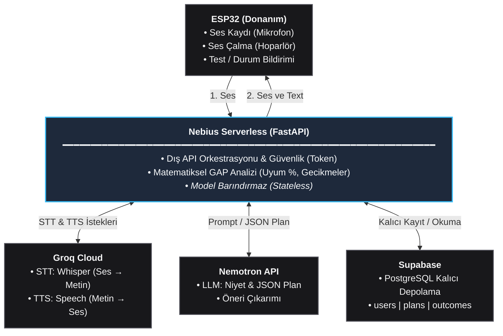

# GAP: FastAPI Merkez Sunucu Sözleşmesi (FastAPI_SCHEMA)

Bu belge; Nebius Serverless üzerinde çalışan **FastAPI** merkez sunucusunun **ESP32 Donanımı** ve **Supabase Kalıcı Veritabanı** ile olan tüm iletişimini, veri modellerini ve istek/yanıt sözleşmelerini eksiksiz ve öz (concise) olarak tanımlar.

> **Not:** Groq (Whisper STT / TTS) ve Nemotron API (LLM) servislerinin iç prompt ve çağrı parametreleri [`docs/AI_SCHEMA.md`](file:///home/ahmet/Desktop/tmp/gap-ai/docs/AI_SCHEMA.md) dosyasında tanımlanmıştır.

---

## 1. Mimari Şema



---

## 2. Bileşen Sorumlulukları

| Bileşen | Sorumluluk / Ne Yapar? |
|---|---|
| **ESP32 (Donanım)** | • 16 kHz Mono WAV kaydı alır, FastAPI'ye gönderir.<br/>• FastAPI'den dönen sentezlenmiş sesi hoparlörden çalar.<br/>• Buton basış durumlarını (`done`, `postponed`, `skipped`) ve telemetriyi iletir.<br/>• Ekranı için yaklaşan planı çeker. |
| **Nebius Serverless (FastAPI)** | • Sistemin tek orkestratörüdür; HTTP isteklerini karşılar.<br/>• Token hash kontrolü ile kimlik doğrular.<br/>• Dış API (Groq, Nemotron) ve Supabase işlemlerini sırayla yürütür.<br/>• Deterministik GAP analizini (uyum yüzdesi, gecikmeler) Python ile hesaplar. |
| **Supabase (PostgreSQL)** | • Kalıcı kullanıcı, plan ve sonuç kayıtlarını barındırır (Uzun Süreli Hafıza). |

---

## 3. ESP32 - FastAPI İletişim Sözleşmesi

ESP32'den gelen tüm isteklerde `Authorization: Bearer <RAW_DEVICE_TOKEN>` başlığı zorunludur.

### 3.1. `POST /voice` (Ses Kaydı Alma ve Yanıt Dönme)
* **Kullanım:** Kullanıcı konuşur; ses FastAPI'ye gider, işlenir ve sesli geri bildirim döner.
* **Headers:** `Authorization: Bearer <TOKEN>`, `Content-Type: multipart/form-data`
* **Form-Data:**
  * `audio`: Binary dosya (`16 kHz, 16-bit Mono WAV`, maks. 10 sn / ~320 KB)
* **FastAPI Akışı:**
  1. Token doğrulanır: `user_id` ve `timezone` alınır.
  2. Groq STT çağrılır: Metin transkripti alınır.
  3. Nemotron LLM çağrılır: `ai/schema.json` formatında ParsedPlan alınır.
  4. Supabase `plans` tablosuna INSERT yapılır: `plan_id` üretilir.
  5. Groq TTS ile onay cümlesi seslendirilir: Ses dosyası alınır.
* **Response (HTTP 201 Created):**
  * `Content-Type: audio/wav` (veya `audio/mpeg`)
  * `Headers`:
    * `X-Plan-ID: <UUID>`
    * `X-Transcript: <URL-Encoded Türkçe Metin>`
    * `X-Response-Text: <URL-Encoded Geri Bildirim Metni>`
  * `Body`: ESP32'nin doğrudan I2S üzerinden hoparlöre basacağı binary ses verisi.

---

### 3.2. `POST /plans/{id}/outcome` (Fiziksel Buton Durum Bildirimi)
* **Kullanım:** ESP32 üzerindeki butonlara basıldığında görevin sonucunu kaydeder.
  * **Tek Basış:** Yapıldı (`done`)
  * **Çift Basış:** Ertelendi (`postponed`)
  * **Uzun Basış:** Atlandı (`skipped`)
* **Headers:** `Authorization: Bearer <TOKEN>`, `Content-Type: application/json`
* **Path Parametresi:** `id` (UUID - Plan kimliği)
* **Request Body:**
  ```json
  {
    "status": "done",
    "reported_via": "device",
    "note": null
  }
  ```
  *(Geçerli `status` değerleri: `"done"`, `"postponed"`, `"skipped"`)*
* **Response (HTTP 201 Created):**
  ```json
  {
    "id": "uuid-outcome-id",
    "plan_id": "uuid-plan-id",
    "status": "done",
    "reported_via": "device",
    "reported_at": "2026-10-09T18:00:00+03:00"
  }
  ```

---

### 3.3. `GET /me/upcoming` (ESP32 Ekranı İçin Sıradaki Planı Çekme)
* **Kullanım:** ESP32 ekranında kullanıcının sıradaki planını ("18:00 - Koşu") göstermek için periyodik sorgulanır.
* **Headers:** `Authorization: Bearer <TOKEN>`
* **Query Params:** `since` (opsiyonel ISO-8601), `to` (opsiyonel ISO-8601)
* **Response (HTTP 200 OK):**
  ```json
  {
    "items": [
      {
        "plan_id": "uuid-plan-id",
        "title": "Koşu",
        "category": "sport",
        "planned_start": "2026-10-09T18:00:00+03:00",
        "reminder_at": "2026-10-09T17:45:00+03:00"
      }
    ]
  }
  ```

---

### 3.4. `POST /device/telemetry` (Donanım Sağlığı ve Ping)
* **Kullanım:** ESP32'nin açılışta veya periyodik olarak bağlantı, batarya ve bellek durumunu bildirmesi.
* **Headers:** `Authorization: Bearer <TOKEN>`, `Content-Type: application/json`
* **Request Body:**
  ```json
  {
    "action": "ping",
    "wifi_rssi": -65,
    "battery_pct": 85,
    "free_heap_bytes": 142000,
    "last_error": null
  }
  ```
* **Response (HTTP 200 OK):**
  ```json
  {
    "status": "online",
    "server_time": "2026-10-09T14:30:00+03:00"
  }
  ```

---

## 4. FastAPI - Supabase İletişim Sözleşmesi

FastAPI, Supabase ile HTTPS üzerinden `supabase-py` istemcisi ile haberleşir. Asla veritabanı şifresi veya ham token saklanmaz.

### 4.1. Kimlik Doğrulama & Token Yönetimi
* **Kural:** Ham cihaz tokenı (`raw_token`) veritabanında tutulmaz.
* **İşlem:** FastAPI gelen tokenı şu formülle hashler:
  `token_hash = SHA256(raw_token + TOKEN_HASH_PEPPER)`
* **Sorgu:**
  ```sql
  SELECT id, timezone, display_name FROM users WHERE token_hash = :hash LIMIT 1;
  ```
* Kullanıcı bulunamazsa derhal `HTTP 401 unauthorized` döner.

---

### 4.2. Tablo Eşleşmeleri ve Veritabanı İşlemleri (CRUD)

#### 1. `users` Tablosu
| Sütun | Tip | Kısıt | Açıklama |
|---|---|---|---|
| `id` | `uuid` | PK, default `gen_random_uuid()` | Kullanıcı benzersiz kimliği |
| `token_hash` | `text` | Unique, Not Null | Cihaz/erişim anahtarının SHA-256 özeti |
| `display_name` | `text` | Default `'User'` | Kullanıcı adı |
| `timezone` | `text` | Default `'Europe/Istanbul'` | Saat hesaplamaları için saat dilimi |
| `created_at` | `timestamptz` | Default `now()` | Oluşturulma tarihi |

#### 2. `plans` Tablosu (Plan Kaydı)
FastAPI `POST /voice` sonucunda LLM'den gelen veriyi normalleştirip bu tabloya ekler:
* **Ekleme İşlemi (Insert):**
  ```sql
  INSERT INTO plans (user_id, title, category, planned_start, planned_end, recurrence_rule, source)
  VALUES (:user_id, :title, :category, :planned_start, :planned_end, :recurrence, 'device')
  RETURNING id, title, planned_start, planned_end;
  ```
* **Normalizasyon Kuralı:** 
  * `planned_start` = `date` + `time` + kullanıcının `timezone` bilgisi.
  * `planned_end` = `planned_start` + `duration_minutes` (varsayılan 60 dk).
* **Kategori Kısıtı:** `'sport'`, `'study'`, `'work'`, `'meeting'`, `'health'`, `'social'`, `'personal'`, `'other'`.

#### 3. `outcomes` Tablosu (Sonuç Olayları)
Bir plan için birden fazla sonuç olayı girilebilir (örn. önce ertelendi, sonra yapıldı):
* **Ekleme İşlemi (Insert):**
  ```sql
  INSERT INTO outcomes (plan_id, status, actual_start, postponed_to, reported_via, note)
  VALUES (:plan_id, :status, :actual_start, :postponed_to, 'device', :note)
  RETURNING id, status, reported_at;
  ```
* **Kısıt:** `status IN ('done', 'postponed', 'skipped')`.

#### 4. `insights` Hesaplama (Deterministik GAP Analiz Motoru)
FastAPI periyodik olarak veya `GET /insights` çağrıldığında Supabase'ten geçmişi çeker:
* **Analiz Sorgusu:**
  ```sql
  SELECT p.id, p.category, p.planned_start, o.status, o.reported_at
  FROM plans p
  LEFT JOIN outcomes o ON o.plan_id = p.id
  WHERE p.user_id = :user_id AND p.planned_end < now();
  ```
* **Matematiksel Hesaplama (Python içinde):**
  * Formül: `adherence_pct = (tamamlanan_plan_sayisi / raporlanan_toplam_plan) * 100`
  * Bildirilmeyen (`unreported`) geçmiş planlar paydaya katılmaz.
  * Hangi gün ve saatlerde erteleme (`postponed`) yoğunlaştığı tespit edilir.

---

## 5. Hata Standartları ve Ortam Değişkenleri

### Ortak Hata Gövdesi
```json
{
  "error": "validation_error",
  "message": "Payload does not match contract"
}
```
* **401 `unauthorized`:** Geçersiz token veya kullanıcı bulunamadı.
* **404 `not_found`:** İstenen plan kullanıcıya ait değil veya mevcut değil.
* **413 `payload_too_large`:** Ses dosyası 10 saniyeyi / ~320 KB'ı aştı.
* **422 `validation_error`:** Şema veya tip hatası.
* **502 `upstream_error`:** Groq, Nemotron veya Supabase bağlantı hatası.

### Gerekli Ortam Değişkenleri (`.env`)
```env
# Sunucu
PORT=8000
ENVIRONMENT=production

# Supabase
SUPABASE_URL=https://<proje-ref>.supabase.co
SUPABASE_SERVICE_KEY=eyJh... # Backend servis anahtarı (cihaza/web'e verilmez)
TOKEN_HASH_PEPPER=gizli_pepper_anahtari

# Harici AI Servisleri
GROQ_API_KEY=gsk_...
NEBIUS_API_KEY=...
NEBIUS_BASE_URL=https://api.studio.nebius.ai/v1/

# Kısıtlar
MAX_AUDIO_SECONDS=10
```
